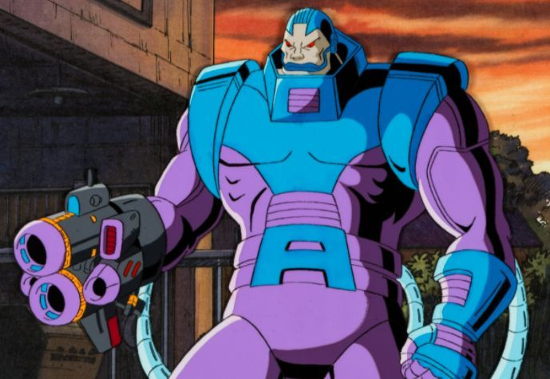
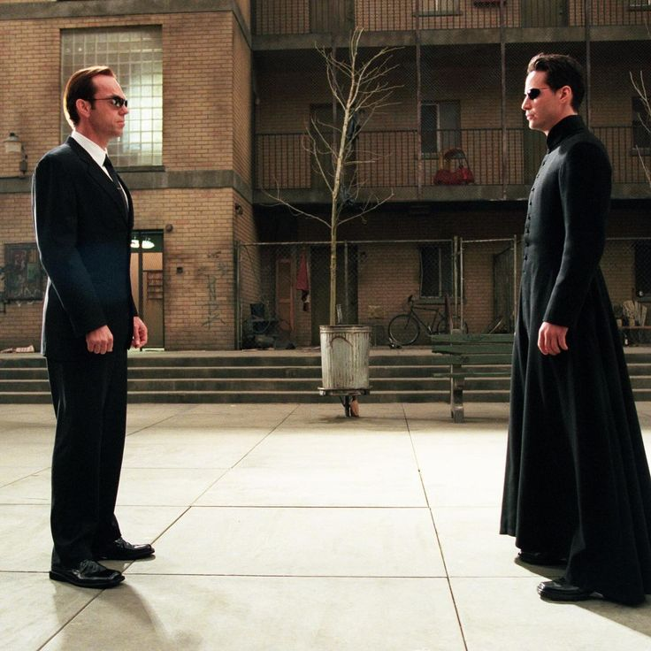
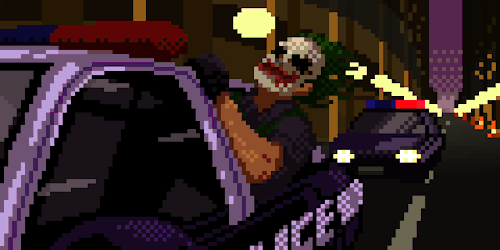

# Hi there! 👋 I'm Javier, a Full Stack Developer

## 🚀 About Me

I'm a **passionate Full Stack Developer** with a love for building scalable, high-performance applications. My journey into coding began with curiosity, and it has transformed into a deep enthusiasm for problem-solving, innovation, and continuous learning.

When I'm not coding, I'm probably discussing tech trends, contributing to the developer community, or watching great movies (you can see some of my favorite quotes below!).

## 🌱 What I'm Currently Working On

I'm currently building **Workahomie**! It's an app designed to connect professionals and people with shared occupations who want to work together for a day. Think of it as a Couchsurfing for workspaces, where users can host others in their homes to share a productive day.

## 🛠️ My Tech Stack

## 📫 Let's Connect!

- **LinkedIn:** [linkedin.com/ocampojavieralfonso](https://www.linkedin.com/in/ocampojavieralfonso/)
- **Portfolio:** [[Your Portfolio URL](https://javieroc.github.io/portfolio-astro/)]

---

## 🎬 Some of My Favorite Movie Quotes

<table>
  <tr>
    <td align="center">
      
       
      <em>The Hobbit: The Desolation of Smaug</em>
    </td>
    <td>
      <blockquote>
        "There is something about you. Something you carry. Something made of Gold. But Far... More... Precious!"
      </blockquote>
      <blockquote>
        "The coward Oakenshield has weighed the value of your life and found it worth nothing."
      </blockquote>
      <blockquote>
        "I am fire, I am... DEATH!"
      </blockquote>
    </td>
  </tr>
  <tr>
    <td>
      <blockquote>
        "Time is motion and motion and though are unity. Two aspects of a single power that is beyond comprehension to all but myself. That is why certain psychics can see into the future. The mind can transcend the time!."
      </blockquote>
    </td>
    <td align="center">
      
       
      <em>X-Men: Apocalypse</em>
    </td>
  </tr>
  <tr>
    <td align="center">
      
       
      <em>The Matrix Reloaded</em>
    </td>
    <td>
      <blockquote>
        "But, as you well know, appearances can be deceiving, which brings me back to the reason why we're here. We're not here because we're free. We're here because we're not free. There is no escaping reason; no denying purpose. Because as we both know, without purpose, we would not exist."
      </blockquote>
    </td>
  </tr>
  <tr>
    <td>
        <blockquote>
            "Do I really look like a guy with a plan? You know what I am? I'm a dog chasing cars. I wouldn't know what to do with one if I caught it! You know, I just... *do* things."
        </blockquote>
    </td>
    <td align="center">
        
         
        <em>The Dark Knight</em>
    </td>
  </tr>
</table>
